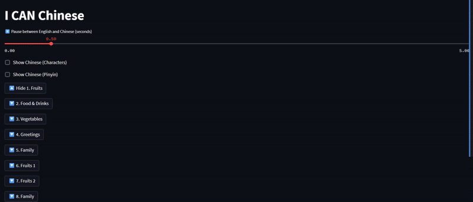

This project is for my upcoming Chinese Learning App!

At the moment it's a podcast and a streamlit app.
The idea is that it's audio notecards:
- You hear an english word
- You're given a pause to think and say the corresponding chinese word
- The chinese word is said
Repeat for however many words in the list.

For the Streamlit. You can deselect words, you can toggle the view for the character and pinyin, and you can adjust the pause length.

In order to run this on your local machine:
- download all the files here
- open terminal and navigate to where it's stored
- and type: "streamlit run i_can_chinese_streamlit.py"
And then it should open a webpage with the app
